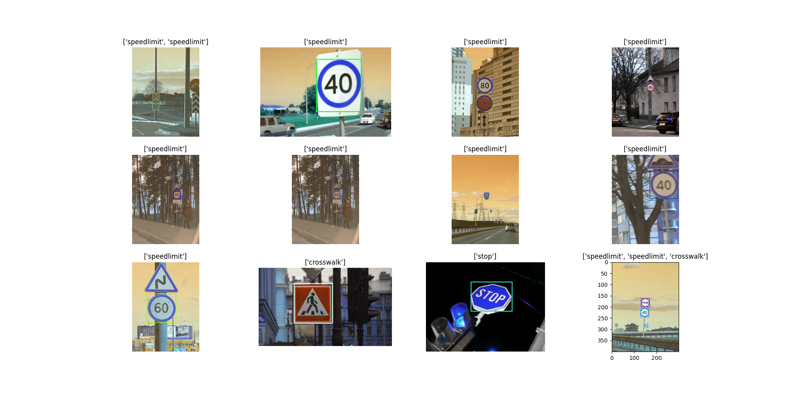

# Road Signs Detection using FasterRCNN

This project focuses on detecting various road signs using a FasterRCNN pre-trained model. The goal is to detect and draw bounding boxes on objects of interest.

---

## 📊 Project Overview

- **Task**: Object Detection
- **Dataset**: Images with various road signs (e.g., speed limit, stop, crosswalk etc.)
- **Model**: FasterRCNN (pre-trained on CoCo dataset)
- **Framework**: PyTorch
- **Evaluation Metrics**: Bounding boxes, mAP

---

## 🗂️ Dataset Samples

Below are some random samples from the dataset with corresponding labels:


---

## 📈 Inference Results

Here are the results of inference:

### Inference Results


---

## 🚀 How to Run

1. Clone the repository:
   
   ```
   git clone https://github.com/akhra92/Road_Sign_Detection_With_FasterRCNN.git
   cd Road_Sign_Detection_With_FasterRCNN
   ```

3. Install dependencies:

   ```
   pip install -r requirements.txt
   ```
   
4. Train and validate the model:

   ```
   python main.py
   ```

5. Inference:
   
   ```
   python inference.py
   ```